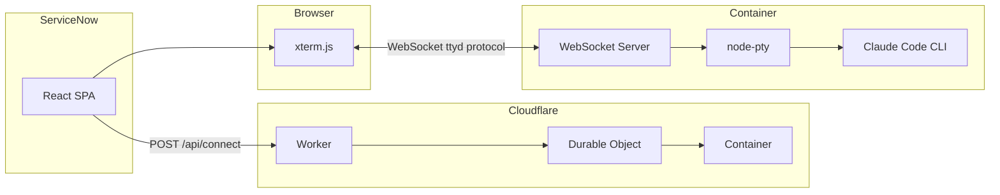

# ServiceNow with Claude Code in Cloudflare Containers

Run Claude Code CLI in isolated Cloudflare containers with a web-based terminal interface. 

Designed to be embedded in ServiceNow as a single-page application:


> **Note:** The backend must be deployed to Cloudflare - it cannot run locally. Cloudflare Containers are only available in the Cloudflare production environment. The frontend can be developed locally and will connect to your deployed Cloudflare Worker.

## Architecture



**Flow:**
1. User opens the React app (hosted in ServiceNow or standalone)
2. User enters credentials and clicks Connect
3. Frontend POSTs to Cloudflare Worker `/api/connect`
4. Worker creates a Durable Object which spawns a container
5. Container starts Claude Code CLI with a WebSocket server
6. Frontend establishes WebSocket connection for real-time terminal I/O

## Frontend

**Tech Stack:** React + Vite + Tailwind CSS + xterm.js

The frontend is a single-page application that provides:
- **ConnectForm** - Credential input with localStorage persistence
- **Terminal** - xterm.js terminal emulator with ttyd protocol support
- **StatusBar** - Connection status and session info

### Build Output

Vite is configured with `vite-plugin-singlefile` to produce a single `index.html` file with all JS, CSS, and images inlined as base64. This makes deployment to ServiceNow straightforward.

```bash
npm run build    # Outputs frontend/dist/index.html
```

### ServiceNow Deployment

The frontend is deployed to ServiceNow using the reference architecture at:
https://github.com/elinsoftware/servicenow-react-app

This approach embeds the React SPA as a UI Page or Service Portal widget, allowing it to run within the ServiceNow context and auto-detect the instance URL.

## Backend (Cloudflare Worker)

**Tech Stack:** Cloudflare Workers + Durable Objects + Containers

The backend consists of:

### Worker (`worker/src/index.ts`)
- HTTP request router
- WebSocket upgrade handling
- Routes requests to Durable Objects

### Durable Object (`ClaudeContainer`)
- Manages container lifecycle (create, connect, destroy)
- Proxies WebSocket connections between frontend and container
- Handles session persistence

### Container (`worker/Dockerfile`)
- Node.js 20 base image
- Runs `server.js` - a WebSocket server using node-pty
- Claude Code CLI installed globally
- Receives credentials via environment variables

## Project Structure

```
frontend/
  src/
    App.tsx              # Main component, connection state
    components/
      ConnectForm.tsx    # Credential form
      Terminal.tsx       # xterm.js + ttyd protocol
      StatusBar.tsx      # Connection indicator
    utils/
      storage.ts         # localStorage helpers
    assets/
      hero.png           # Landing page image

worker/
  src/
    index.ts             # Worker + Durable Object
  server.js              # Container WebSocket server
  Dockerfile             # Container image
  wrangler.jsonc         # Cloudflare config
```

## Development

**Important:** The backend (Cloudflare Worker + Containers) cannot run locally. Cloudflare Containers require deployment to Cloudflare's production environment. For development:

1. Deploy the worker to Cloudflare first: `npm run deploy`
2. Run the frontend locally and point it to your deployed worker URL

```bash
# Install dependencies
npm install

# Deploy backend to Cloudflare (required first)
npm run deploy

# Run frontend locally (port 5173)
npm run dev:frontend
```

The frontend dev server will proxy API requests to your deployed Cloudflare Worker.

## Deployment

```bash
# Deploy worker to Cloudflare
npm run deploy

# Build frontend for ServiceNow
npm run build
```

## API Endpoints

| Endpoint | Method | Description |
|----------|--------|-------------|
| `/api/connect` | POST | Create session, returns `sessionId` + `wsUrl` |
| `/api/terminal/:sessionId` | WebSocket | Terminal I/O (ttyd protocol) |
| `/api/disconnect` | POST | Stop container |
| `/health` | GET | Health check |

### POST /api/connect

**Request:**
```json
{
  "instance": "dev12345.service-now.com",
  "username": "admin",
  "password": "...",
  "anthropicApiKey": "sk-ant-..."
}
```

**Response:**
```json
{
  "sessionId": "uuid",
  "wsUrl": "wss://worker.workers.dev/api/terminal/uuid"
}
```

## ttyd Protocol

The container runs a WebSocket server implementing the ttyd protocol:

**Client → Server:**
- `"0" + data` - Terminal input (keystrokes)
- `"1" + JSON` - Resize event `{"columns": 80, "rows": 24}`

**Server → Client:**
- `[0x00] + data` - Terminal output (binary)
- `[0x01] + data` - Window title
- `[0x02] + data` - Preferences

## Key Details

- Containers auto-sleep after 10 minutes of inactivity
- Sessions identified by UUID, enabling reconnection
- Credentials stored in localStorage (frontend) and passed to container as env vars
- Frontend auto-detects ServiceNow instance from `window.location.hostname`

## License

MIT License - see [LICENSE](LICENSE) for details.

Contact: info@elinsoftware.com
