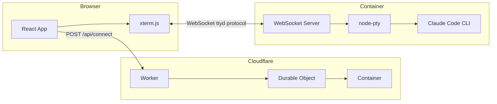

# Claude Code in Cloudflare Containers

Run Claude Code CLI in isolated Cloudflare containers with a web-based terminal interface.

## Architecture



**Flow:**
1. User submits credentials via React form
2. Worker creates a container via Durable Object
3. Container runs Claude Code CLI with a WebSocket server (ttyd protocol)
4. Frontend connects via WebSocket for real-time terminal I/O

## Project Structure

```
frontend/           # React SPA (Vite + Tailwind + xterm.js)
worker/             # Cloudflare Worker + Durable Object + Dockerfile
```

## Quick Start

```bash
# Install dependencies
npm install

# Development (frontend + worker)
npm run dev

# Deploy to Cloudflare
npm run deploy
```

## API Endpoints

| Endpoint | Method | Description |
|----------|--------|-------------|
| `/api/connect` | POST | Create session, returns sessionId + wsUrl |
| `/api/terminal/:sessionId` | WebSocket | Terminal I/O (ttyd protocol) |
| `/api/disconnect` | POST | Stop container |
| `/health` | GET | Health check |

## ttyd Protocol

Binary WebSocket messages:
- **Client → Server:** `"0" + input` (keystrokes), `"1" + JSON` (resize)
- **Server → Client:** `[0x00] + data` (terminal output)

## Key Details

- Containers auto-sleep after 10 minutes idle
- Sessions persist via UUID, enabling reconnection
- Credentials passed to container as environment variables
